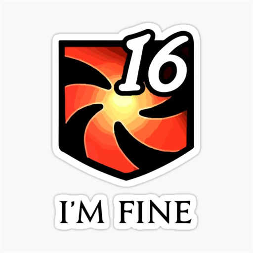

# Mitmaxxing

> Are you even mitmaxxing, bro?

A Dalamud plugin for FFXIV that shows how hard your party is mitigating — and, when you inevitably explode, exactly what killed you.



## Installation

Add this URL to your custom plugin repositories in `/xlsettings` → **Experimental** → **Custom Plugin Repositories**:

```
https://raw.githubusercontent.com/ResFox/mitmaxxing/main/repo.json
```

Then open `/xlplugins`, search for **Mitmaxxing**, and install.

## Modules

- **Mini overlay** — two icons (physical / magical) with the additive damage reduction currently active on your target. Drop it above the boss bar.
- **Mit Tracker** — a full list of every active mitigation: status icon, name, P/M %, time remaining, and the player who applied it. Shows the real (multiplicative) reduction too. Built for tanks and raid leads to track who used what and when.
- **Death Recap** — when anyone in your party dies, a recap records the seconds leading up to it: every hit (with real damage and overkill), heals, shields, and the buffs/debuffs that were up. Killing-blow card up top, full timeline below, phys/magic breakdown.

## Commands

| Command | Action |
| --- | --- |
| `/mitstack` | toggle the 2-icon overlay |
| `/mitstack list` | toggle the Mit Tracker |
| `/mitstack deaths` | toggle the Death Recap |
| `/mitstack testdeath` | preview the recap with fake data |
| `/mitstack config` | open settings |
| `/mitstack debug` | print active status IDs to `/xllog` |

## Credits / Inspirations

- **[Death Recap](https://github.com/Kouzukii/ffxiv-deathrecap)** by Kouzukii — the combat-event capture (ActionEffect / ActorControl / EffectResult packet hooks) is based on their work. All credit for the capture approach goes to them.
- **[event-trigger](https://github.com/xpdota/event-trigger)** by xpdota — reference for mitigation status IDs and values.
- Built on [Dalamud](https://github.com/goatcorp/Dalamud).
